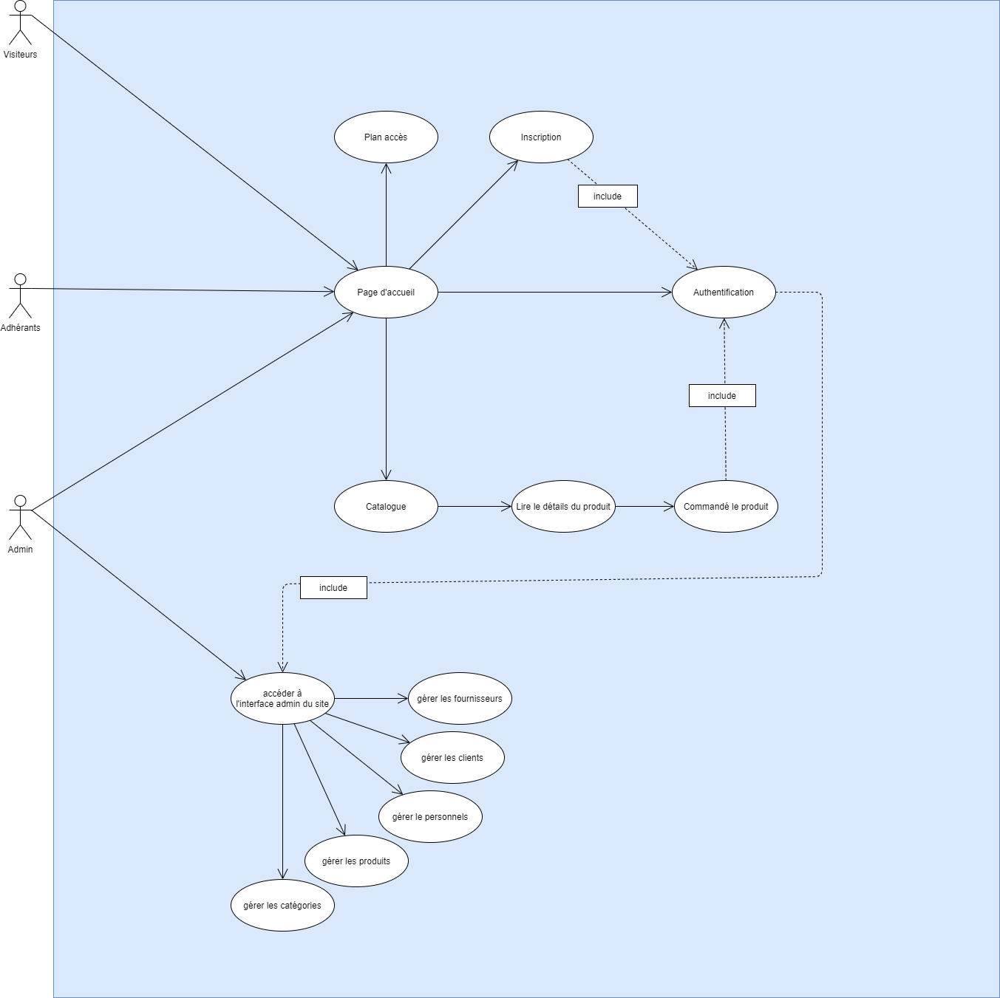
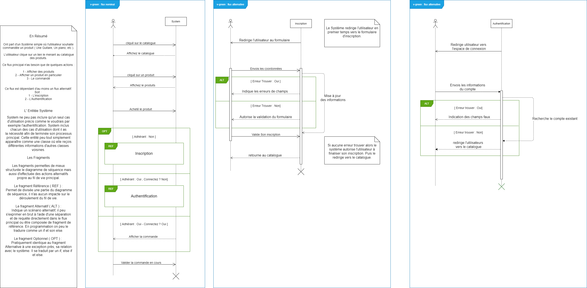
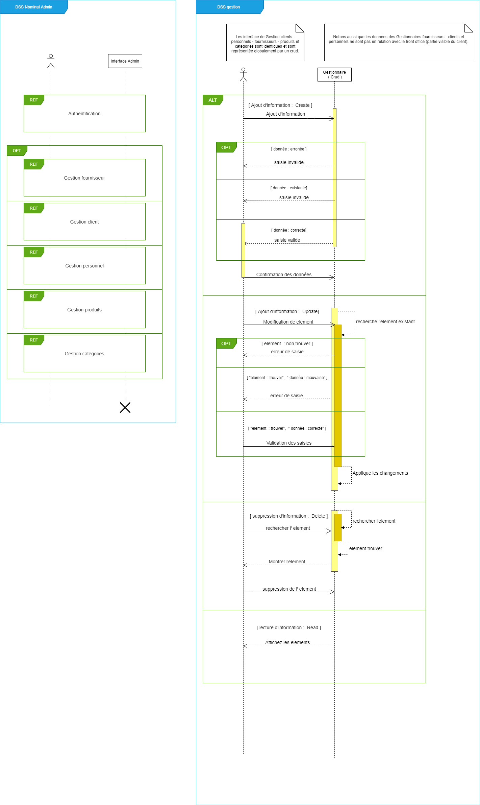
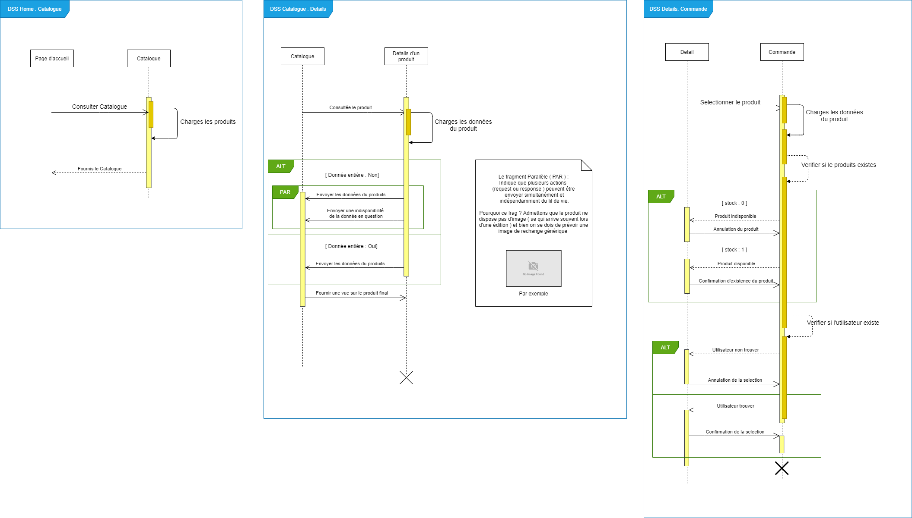
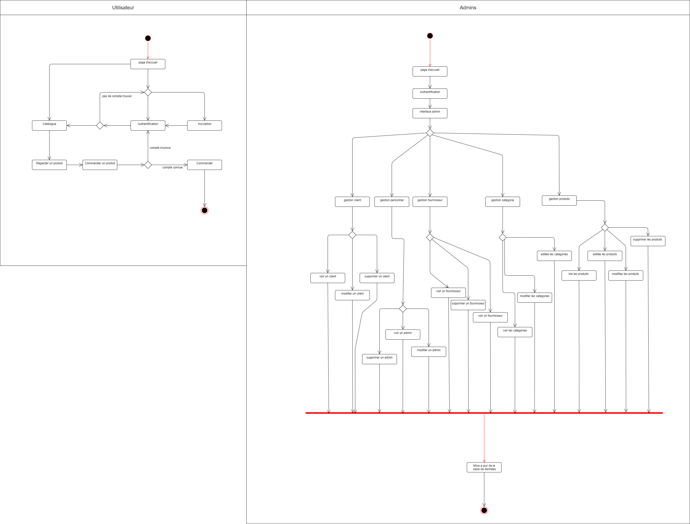

### Diagrammes de v-green

+ [Diagramme de cas utilisation](#dcu)
+ [Diagramme de séquence de système](#dss)
+ [Diagramme d'activitée](#dac)

_____

#### <a id=dcu>Diagramme de cas d'utilisation</a>

_____

#### <a id=dss>Diagramme de séquence système</a>

_____

#### <a id=dac>Diagramme d'activitée</a>

